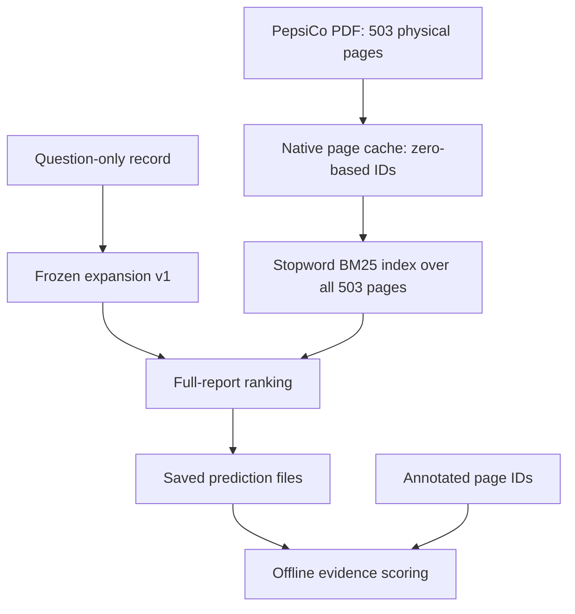

# Multi-page review and one-question retrieval trace

Review date: 2026-10-09. Repository starting point:
`585390fe08fc2d719b72c78c4384881cd135ad8b`.

**Continuation from b15a868:** the full native cache has now been supplied and
validated. [The native-cache diagnostic](NATIVE_CACHE_DIAGNOSTIC.md) resolves the
initial DF/average-length, term-attribution, and annotation-only page limitations
below. This document preserves the initial review's artifact availability and
historical handoff; another cache upload is no longer needed. Expansion v1 is unchanged.

The frozen expansion control retrieves part of the annotated evidence for four
multi-page questions and none for the fifth. It retrieves **no complete annotated
multi-page set at k=5**. The traced PepsiCo example shows a ranking/completeness
failure despite the missing statement's relevant line item being present in the
supplied native text. This review precedes section-context implementation, following
the researcher's advisor feedback.

## Frozen development control

`financial-question-terms-v1` is retained with policy SHA-256
`80414d370839eceef3dc5c8574b57d65a22f7551ddad520c263dc4c15c67f1a3`.
The documentation snapshot is `docs/EXPANSION_V1_CONTROL.json`. It records the
exact policy/configuration, cohort and artifact identities, allowed inputs,
exclusions, and change rule. A policy fingerprint test guards against silently
changing v1. The snapshot does not introduce a new executable configuration.

Keep the same source cache, zero-based page IDs, question projection, fixed
stopwords, BM25 k1=1.2 and b=0.75, binary query frequency, all within-report page
candidates, and score-descending/page-index-ascending tie rule. Keep the original
and stopword conditions as historical controls. Later structural effects are
measured against this frozen expansion control, without quietly retuning it.

The reference run is `20261009T020622Z-76a16239e13d`. Its verified whole-pilot
Recall@5 is 40.97%, any-evidence Hit@5 is 12/24, and complete coverage@5 is 8/24.
Those eight complete cases are all single-page annotation sets. This is still a
development result, designed after labeled diagnostics, not held-out validation.

## Evidence available for this review

The newly supplied `pilot_tasks.jsonl` contains the same 24 tasks and matches the
frozen annotation SHA-256:
`1d1bfa444a3041b3e51be9535ff276fc89fa3d7985231a0bd7f4aa6746395356`.
Exactly five tasks have more than one distinct annotated page. They contain 11
task/page references but only nine unique report/page pairs across three reports;
the two PepsiCo numerical questions reuse pages 61 and 63.

The prior original/stopword/expansion predictions, expansion audit, manifests,
metrics, and 25-page native diagnostic remain available. All seven expansion
artifact hashes were checked again. The policy at commit 585390f matches the
recorded run policy. Diagnostic page IDs, source hashes, character counts, and
normalized text were checked against the recorded native run.

This is **offline, label-exposed development review**. Annotation snippets/full-page
text and annotated answers can establish intended evidence roles, but are not
independently verified PDF transcription. Native diagnostic records are available
for AMD pages 55/59 and PepsiCo pages 61/63, plus selected competing pages. Native
records/PDF views for Boeing pages 7/9/13 and PepsiCo pages 3/4 are not supplied.
Their content observations below come from the annotation's full-page text. Do
not claim native-text quality was inspected for those five pages.

This document contains label-derived review information and reference arithmetic.
Exclude it from retrieval indexes, model prompts, and correction/ledger memory.

## Five-question comparison

All page IDs are zero-based physical PDF indices. Ranks are one-based. Rank lists
follow the page order shown. Recall@5 is the fraction of annotated pages retrieved.

| Question | Report / intended task | Annotated pages | Original ranks | Stopword ranks | Frozen expansion ranks | Expansion Recall@5 |
|---|---|---|---|---|---|---:|
| 03069 | AMD 2015 D&A margin | 55, 59 | 64, 6 | 25, 1 | 25, 1 | 1/2 |
| 01290 | Boeing 2022 primary customers | 7, 9, 13 | 50, 3, 148 | 39, 3, 161 | 39, 3, 161 | 1/3 |
| 01009 | PepsiCo 2022 operating geographies | 3, 4 | 35, 10 | 228, 20 | 228, 20 | 0/2 |
| 03620 | PepsiCo 2022 EBITDA less capex | 61, 63 | 18, 1 | 17, 1 | 23, 1 | 1/2 |
| 04481 | PepsiCo 2022 EBITDA margin | 61, 63 | 38, 13 | 33, 14 | 24, 1 | 1/2 |

The frozen condition therefore has four partial sets, one miss, and zero complete
sets in this five-question diagnostic group. This is a post hoc subgroup review
of existing real run outputs, not a new retrieval experiment. First-hit MRR can be
1 for the numerical questions while the essential second statement is missing.

### 03069: AMD D&A margin — two different statements

Page 55 is the consolidated operations statement and supplies FY2015 net revenue
of 3,991. Page 59 is the cash-flow statement and supplies D&A of 167. Both are in
millions, and the statements contain multiple year columns. Human reference
arithmetic is `167 / 3,991 × 100 = 4.1844%`, consistent with the annotated 4.2%.
This is a reviewer calculation, not an automated answer.

The expansion condition retrieves page 59 at rank 1 but page 55 at rank 25. The
D&A rule matches but adds no terms, because its vocabulary is already in the
question; the expansion ranking equals stopwords. The missing dependency is the
revenue-bearing statement, not the presence of a D&A keyword. Source-derived
statement context is a plausible diagnostic direction, but a D&A heading alone
would not guarantee retrieval of the operations statement. Preserve year and units
when interpreting rows. Printed statement footers 54/58 differ from PDF IDs 55/59.

### 01290: Boeing customers — dispersed prose and a qualifier

The annotation's page 7 supplies commercial-airline concentration, page 9 supplies
U.S.-government revenue dependence, and page 13 supplies the 2022 40% government
contract revenue qualifier. Page 7 contains `Item 1A. Risk Factors` and `Risks
Related to Our Business and Operations`; page 13 contains `Risks Related to Our
Contracts`. Page 9 includes a defense-spending subheading and forward-looking FY24
discussion, so year tokens alone are not reliable section labels.

Only page 9 is in the top five. No v1 financial-metric rule matches, so expansion
does not change the stopword ranking. A detector restricted to financial statements
would omit this question's relevant prose. Broad risk-section context may still
be too coarse to recover the separate commercial and government-contract spans.

The annotated answer includes the 40% qualifier although the question asks who
the primary customers are. Full annotated-set coverage requires all three pages
under the current evaluator. That does not prove three pages are the only minimal
evidence set for the core customer-category answer. Alternative supporting passages
are possible; do not equate every non-gold page with irrelevant text or automatically
equate incomplete annotation coverage with inability to answer.

### 01009: PepsiCo geographies — a continued list

The annotated full-page text on page 3 transitions from forward-looking statements
to `Item 1. Business`, then `Company Overview` and `Our Operations`. The operations
list begins with North American divisions, Latin America and Europe. Page 4 begins
with items 6 and 7: Africa/Middle East/South Asia and Asia Pacific/Australia/New
Zealand/China, then moves into division descriptions.

Neither page is in the top five. No v1 rule matches; the ranking equals stopwords.
This is an adjacent-page list-continuation case, unlike the separated financial
statements. A candidate heading approach needs to recognize the actual operations
heading and its continuation, while handling several section transitions within
page 3. References to other Items inside prose are not observed current headings.

Adjacency alone cannot fix this run: it would first need to select the relevant
list area, and it would consume the same final page budget. Heading enrichment and
adjacent-page packing should be separate interventions if later tested.
Also, `operates` in the question and `Operations` in the heading are different
tokens under the frozen tokenizer, which performs no stemming. Merely inheriting
that heading does not guarantee a new lexical match; any semantic section-matching
rule would need its own declared policy rather than a silent change to v1.

### 03620: PepsiCo EBITDA less capex — three operands on two pages

The question itself defines unadjusted EBITDA as operating income plus D&A; using
that definition is legitimate question input. Page 61 supplies FY2022 Operating
Profit of 11,512. Page 63 supplies D&A of 2,763 and Capital spending shown as the
cash outflow `(5,207)`. The reported unit is millions. Human reference arithmetic
is `11,512 + 2,763 - 5,207 = 9,068 USD million`, consistent with the annotated
`$9068.00` magnitude when its unit is retained. Subtract the positive capex
magnitude, or add the signed outflow; do not subtract a negative a second time.

Expansion keeps page 63 at rank 1 but moves page 61 from rank 17 to 23. Page-based
recall stays 1/2. The retrieved annotated page contains two of the three identified
operands, illustrating why page recall is not an operand-completeness metric.
The missing Operating Profit remains a critical dependency. The full trace follows.

### 04481: PepsiCo EBITDA margin — same pages, different dependency pattern

Page 61 supplies Operating Profit of 11,512 and Net Revenue of 86,392; page 63
supplies D&A of 2,763. Human reference arithmetic is
`(11,512 + 2,763) / 86,392 × 100 = 16.5235%`, consistent with the annotated 16.5%.

Expansion moves the cash-flow page from rank 14 to 1, but the income statement
only moves from rank 33 to 24. This is the multi-page question that gained a
top-five annotated page in the expansion experiment. It still lacks two operands
located on page 61. The same 1/2 page recall as 03620 corresponds to different
operand availability. These two questions share source pages and should not be
presented as independent document-level examples of structural success.

## Trace: financebench_id_03620 through the current pipeline



### 1. Source and extraction

Report ID: `financebench:PEPSICO_2022_10K`. The recorded source checksum is
`7d8a9f3374e429c58f101319e2da8a0e601a89859e1e4f6854163dd5f8ce6b47`.
The original native run validated 503 physical pages and source checksums before
and after extraction. pypdf 6.19.0 extracted plain native text sequentially; this
was not OCR. Every physical page retained its zero-based index.

The supplied native diagnostic shows page 61 with 1,204 raw characters and status
`ok`, including `Operating Profit 11,512 11,162 10,080`. Page 63 has 2,108 raw
characters and status `ok`, including `Depreciation and amortization 2,763 ...`
and `Capital spending (5,207) ...`. Thus these key line items exist in the extracted
representation. Native extraction is still not independently verified transcription
ground truth or a guarantee of correct visual column interpretation.

Raw text is preserved. Search normalization performs NFKC normalization, converts
Unicode minus to ASCII minus, and collapses whitespace. The tokenizer case-folds
text and preserves numeric tokens. `FY2022` becomes `fy`, `2022`; a standalone
`+` is not a token, and parentheses are punctuation rather than an encoded negative
sign. Source raw text must remain authoritative for later sign/column interpretation.

### 2. Query isolation

Only `task_id`, `doc_id`, and `question` are copied into `RetrievalQuery`. The
original question is:

> What is the FY2022 unadjusted EBITDA less capex for PepsiCo? Define unadjusted EBITDA as unadjusted operating income + depreciation and amortization [from cash flow statement]. Answer in USD millions. Respond to the question by assuming the perspective of an investment analyst who can only use the details shown within the statement of cash flows and the income statement.

The annotated answer, justification, evidence text and evidence indices are not
query inputs. Metadata reviewed above stays on the offline reviewer/evaluator side.

### 3. Fixed expansion and stopword tokenization

Matched rules: `ebitda`, `capital_expenditure`, `depreciation_amortization`.
After removing already-present content terms, the exact appended terms are:

```text
capital equipment expenditures plant profit property purchases spending
```

No terms are discarded by the 32-term cap. The saved audit has 38 original and
46 expanded content-token occurrences. BM25 uses sets of query tokens: 31 original
distinct terms and 39 after expansion. Repeated `unadjusted`, `statement`, or
`EBITDA` occurrences do not increase query weight. Instruction-content words such
as `analyst`, `assuming`, `perspective`, and `respond` remain; v1 does not remove
role instructions. Their individual score effects are not measured here.

### 4. Index and scoring

The condition uses the unchanged stopword page index: all 503 pages participate
in N, document frequencies and average length. It is not an index of the two gold
pages, the 25 diagnostic pages, or manually chosen statement pages. The page index
does not gain expansion vocabulary; only the query changes.

For each distinct question term t with page frequency tf, the implementation adds:

```text
idf = log(1 + (N - df + 0.5) / (df + 0.5))
contribution = idf * tf * (k1 + 1) /
               (tf + k1 * (1 - b + b * page_length / average_page_length))
```

Here k1=1.2 and b=0.75. Missing terms contribute zero. Summation uses sorted terms;
ranking sorts score descending, then zero-based page ID ascending. Scores are lexical
matching scores, not answer probabilities. All page scores remain in the saved ranking.

### 5. Recorded ranking

| Page | Role observed in supplied native text | Stopword rank / score | Expansion rank / score |
|---|---|---|---|
| 63 | Cash-flow statement; D&A and capital spending | 1 / 34.389094 | 1 / 54.121159 |
| 46 | Non-GAAP definitions including free cash flow and ROIC | 2 / 30.744460 | 2 / 50.939273 |
| 53 | Free-cash-flow reconciliation; capital spending is also present | 3 / 29.684761 | 3 / 45.529998 |
| 76 | Native content not supplied for this review | 9 / 24.405658 | 4 / 40.274602 |
| 54 | Native content not supplied for this review | 13 / 20.563290 | 5 / 37.851027 |
| 61 | Income statement; missing Operating Profit dependency | 17 / 18.811897 | 23 / 23.447328 |

Expansion top five: **[63, 46, 53, 76, 54]**. Stopword top five was
**[63, 46, 53, 105, 62]**. The income statement's score **increases by 4.635432**,
yet its rank worsens. Page 46 gains 20.194814, page 53 gains 15.845237 and page
63 gains 19.732065. The score gap between page 61 and fifth place widens from
6.426183 to 14.403699. This distinguishes a relative ranking failure from a
decrease in that page's absolute score.

These comparisons use the same stopword index. With its positive IDF formula,
appending query terms cannot remove earlier score contributions; the saved scores
also satisfy nondecrease on all 503 pages for this question. That does not prevent
a page from falling in rank. Original versus stopword scores come from differently
tokenized indexes and should not be interpreted the same way.

### 6. What the supplied native text can explain

Counting the eight added terms with the frozen stopword tokenizer gives:

| Added term | Page 61 | Page 63 | Page 46 | Page 53 |
|---|---:|---:|---:|---:|
| capital | 0 | 1 | 6 | 4 |
| equipment | 0 | 1 | 1 | 1 |
| expenditures | 0 | 0 | 1 | 0 |
| plant | 0 | 1 | 1 | 1 |
| profit | 2 | 0 | 1 | 0 |
| property | 0 | 1 | 1 | 1 |
| purchases | 0 | 2 | 0 | 0 |
| spending | 0 | 1 | 3 | 1 |

The missing income statement matches only the added word `profit`; the cash-flow
and competing free-cash-flow pages match broader added capex vocabulary. Page 53
actually contains the requested capex magnitude, so calling it wholly irrelevant
would be incorrect. It still does not supply the missing Operating Profit.

This is evidence of broader lexical matching, consistent with the relative score
gains. It is not a full per-term score attribution: TF alone omits report-wide DF,
average length, and saturation/length normalization. The full 503-page cache is not
supplied, so those exact statistics cannot be independently reconstructed here.
Page content for 76/54 and the other higher-ranked pages also remains uninspected.

### 7. Prediction output and offline evaluation

The runner first reproduces both controls, then saves all three full rankings,
query files and the expansion audit. Only afterward does `load_evidence_labels`
project `task_id`, `doc_id`, and `evidence_pages` for scoring. It does not provide
answers or justification to the retriever. This separation is visible in the code
at commit 585390f and the saved minimal query files/audit.

Offline gold set: **{61, 63}**. Top-five intersection: **{63}**. Therefore this
question has Recall@5=0.5, any-evidence hit=1, complete coverage=0, and full-ranking
reciprocal rank=1. Recall is also 0.5 at k=1 and k=3 because page 63 is first and
page 61 is rank 23. The metrics correctly describe the annotated page coverage;
they do not show that the question has been solved.

### 8. Where the system currently stops

The current program has not packed a final extractor context, selected the correct
year column, read financial operands automatically, interpreted the capex sign,
calculated EBITDA, or generated an answer with citations. The reviewer calculation
of 9,068 USD million illustrates the dependency graph using source/annotation text;
it is not model output or new answer-accuracy evidence. A five-page cutoff used for
retrieval scoring is not implementation of the proposed 4,096-token answer budget.

## Decision before section-context code

The review supports investigating source structure, but does not establish that
heading enrichment will fix all five cases. Use the following constraints for the
next design review:

The missed income statement already contains its title and Operating Profit row
in native text. Repeating that title would mostly change lexical weighting, not
recover an absent heading. Specify what additional source-derived relationship,
continuation context, or ranking cue the structural condition contributes, and
measure it separately. A section label alone does not ensure retrieval of both
statement types needed for a calculated answer.

1. Preserve the frozen expansion policy and full-report candidate set. Keep source
   context separate from annotation/reviewer knowledge; do not write these gold
   page roles into the retrieval index or a context ledger.
2. Observe real heading spans and their source page/offset before declaring a
   current section. Distinguish financial statement titles, risk subheadings, list
   headings, continuation text, running headers and prose references to other Items.
3. Treat repeated `Table of Contents` lines as a navigation/running-header issue to
   inspect, not as proof that every selected page is a contents page. On the supplied
   native pages, that line appears before different real headings/content.
4. Inspect multiple headings on a page, boundaries on the next page, and resets
   before carrying a heading/unit/year. Proposed inherited context remains a weak
   inference with a source pointer, not ground truth. Do not carry 2022 indefinitely
   through future-year risk prose or report attachments.
5. Evaluate complete evidence coverage and question-specific operand/list support
   alongside recall and first-hit MRR. Do not combine heading enrichment, adjacency,
   query rewriting and ledger memory in the first structural ablation.
6. Preserve the same five-page cutoff. Any later heading tokens, adjacent pages,
   or extractor context consume the declared budget; account for their cost.

Before implementing the section policy, obtain the original complete
`native_pages.jsonl` cache. It allows exact DF/average-length/term-contribution
reproduction for this trace and source-derived heading/boundary inspection,
including the five annotation-only pages and uninspected trace competitors. The
original 12-report extraction need not run again. The saved file is approximately
16 MB under the original native run directory.

## Historical Windows handoff (completed)

Apply `multipage-review-freeze.patch` to the repository at 585390f. It adds this
review, the frozen-control snapshot, a v1 policy guard test, and current-state/README
updates. It changes no retrieval implementation and implements no section context.

```powershell
Set-Location "$env:USERPROFILE\Downloads\Research-Seminar-OCR-current"
git status --short
git log -1 --oneline
$patchFile = "$env:USERPROFILE\Downloads\multipage-review-freeze.patch"
git apply --check $patchFile
if ($LASTEXITCODE -ne 0) { throw "Patch check failed; preserve your local changes." }
git apply $patchFile
if ($LASTEXITCODE -ne 0) { throw "Patch application failed." }
& .\.venv\Scripts\python.exe -m unittest discover -s tests -v
if ($LASTEXITCODE -ne 0) { throw "Validation failed." }
```

The local suite now has 77 passing tests, including the new v1 fingerprint guard.
These are software checks, not new experimental results. To find the original
cache for the next diagnostic, select it in Explorer:

```powershell
$nativeCache = "$env:USERPROFILE\financial-ocr-data\derived\native\native-bm25-20261008T051510Z-7fcc394d\native_pages.jsonl"
if (-not (Test-Path -LiteralPath $nativeCache)) { throw "Original native cache not found at the recorded path." }
Start-Process explorer.exe -ArgumentList ('/select,"{0}"' -f $nativeCache)
```

Upload that existing file unchanged for the next source/score diagnostic. No new
baseline or ranking experiment is requested at this stage.
