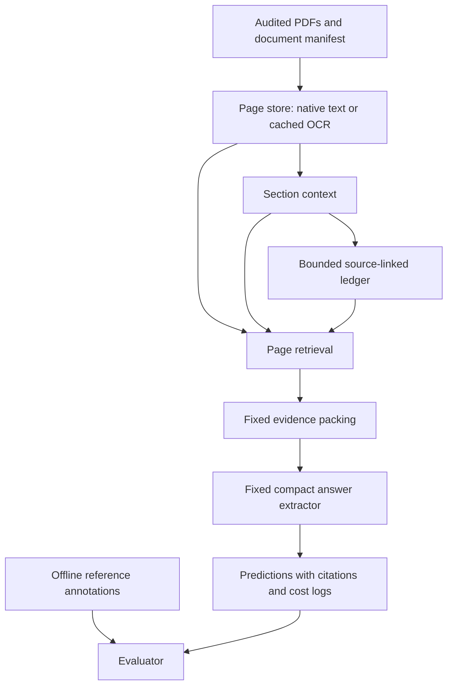

# FinanceBench OCR, retrieval, and bounded context: technical research roadmap

**Version:** 2026-10-08. **Purpose:** detailed experiment design, implementation backlog, and handoff for the next phases. **Status:** Phase 0 and development-pilot structural validation have run; the remaining stages below are proposed work. This document is not a results paper. Read together with `docs/CURRENT_EXPERIMENT_STATE.md` and the real run artifacts.

## 1. Project goal and research scope

The project studies whether financially relevant evidence can be recovered from long annual reports using a compact, locally deployable document pipeline, and whether section context and bounded source-linked memory improve that recovery enough to justify their additional processing cost.

The practical aim is to reduce expensive reasoning over irrelevant pages while preserving the figures, years, units, signs, and surrounding explanations needed for financial questions. A cheaper system that finds the wrong reporting year or confuses revenue with net income is not a successful result.

The primary research question is: **At a fixed final evidence budget, does explicit section context and a bounded context ledger improve financial evidence retrieval and supported answers relative to ordinary page retrieval, after including ingestion and query cost?**

Secondary questions are: how native PDF text and OCR differ in downstream retrieval; how small versus larger OCR page windows affect useful evidence and runtime; which failure types justify later training; and whether an eventual deployment can reuse ingestion work across multiple questions.

The first executable study does not train a new model, modify transformer attention, demonstrate continual learning, or establish transfer to every business document. Training and deployment are later extensions. A novel contribution must isolate the ledger's additional effect; an ordinary search index is already a form of external memory.

The original one-shot versus pagewise OCR idea remains a secondary controlled comparison. It should not dictate an infeasible attempt to submit hundreds of pages to a model in one call.

## 2. Evidence hierarchy and truthful reporting

Use the following labels in reports, updates, and code documentation:

| Label | Meaning | Example |
|---|---|---|
| Verified on user's machine | A supplied real execution log supports it | 27 tests passed; the pilot manifests validated |
| Verified by metadata review | The attached bundle supports it | 112 questions map to 64 annual reports |
| Implemented, not run on corpus | Code exists and appropriate tests passed; real data execution pending | Future native-text command after implementation |
| Proposed | A design choice, not code or a measurement | 32 ledger entries and a 1,024-token cap |
| Conditional extension | Depends on earlier results or hardware | LoRA; larger VLM; cross-document transfer |
| Unresolved | Evidence is insufficient or conflicting | Foot Locker reporting year; actual GPU VRAM |

Synthetic fixture tests verify program behavior, not OCR accuracy. Sampling native text on three pages does not prove all pages have good text. Passing the pilot validator does not prove answers or evidence are semantically correct. A protocol or adapter name is not a functioning integration. Public model benchmarks are not this project's results.

## 3. Foundational paper: what we are adapting

The attached source is **Yuxuan Han et al., “A Multistage Extraction Pipeline for Long Scanned Financial Documents: An Empirical Study in Industrial KYC Workflows,” arXiv:2604.26462v1, 29 April 2026**. It is not the Unlimited OCR paper.

Its workflow separates image preparation, OCR transcription, page localization, and multimodal extraction. It uses hybrid lexical and embedding retrieval so an expensive extraction model receives relevant pages rather than the whole document. It explores PaddleOCRv3 and EasyOCR, with MiniCPM-o-2.6, Gemma-3-27B-IT, and Qwen3-VL-8B-Instruct for extraction. Its reported experiments use a single A100 80 GB GPU and 120 private production KYC documents comprising approximately 3,000 multilingual scanned pages.

The paper reports its best field-level accuracy as 87.27% for PaddleOCR with MiniCPM-o-2.6 and approximately 70% fewer pages forwarded to the VLM. These are **the authors' results on their corpus**, not targets we can assume FinanceBench will meet. Its direct baselines and latency reporting need careful interpretation, including treatment of unsuccessful or oversized inputs. Its limitations include field-specific manual query/prompt design, terminology mismatches, OCR failures, and unit ambiguity. Human feedback refines prompts and queries; that does not demonstrate online weight updates.

| Paper component | Adaptation in this project | Difference that must be stated |
|---|---|---|
| Scanned private KYC inputs | Public annual-report PDFs from FinanceBench | Many PDFs have native text; not an equivalent scanned corpus |
| Preprocessing and OCR | Controlled PDF rendering and a compact OCR baseline | Do not apply destructive scan correction unnecessarily to clean pages |
| Hybrid retrieval | Begin with BM25; optionally add dense retrieval later | BM25 alone is a simplified baseline, not exact replication |
| Compact VLM extraction | One fixed local extractor, chosen after a feasibility test | Text-only extraction would be an architectural adaptation |
| Financial field supervision | FinanceBench QA answers and evidence | QA correctness differs from their field-level accuracy task |
| Manual refinement | Development-only debugging and prompt changes | Evaluation corrections cannot be reused by evaluated components |
| Efficiency motivation | Runtime, memory, tokens, failures, and measured costs | No advance claim of energy savings or a 1/1000 cost ratio |

The proposed extension is a bounded context ledger with source pointers and controlled ablations. Reusing the pipeline idea does not itself establish novelty. Explain how the ledger changes retrieval or interpretation, under what budget, and whether the change survives a comparison to a simpler heading-aware or hybrid retriever.

## 4. Other paper and model references

**Unlimited OCR Works**, arXiv:2606.23050, is a separate reference for long-horizon document parsing. The official Baidu repository exposes single-image and multipage inference examples. It motivates the window-size comparison, not the KYC pipeline or a claim that FinanceBench can be processed in one unconstrained call.

Official documentation checked on 2026-10-08 includes Baidu Unlimited-OCR, PaddleOCR's quick start, and the official Qwen model cards listed in Section 34. Pin the revision used in experiments; online instructions can change. Do not silently change to a new checkpoint because the default download changed.

## 5. Verified environment and repository

| Item | Current state |
|---|---|
| Public repository | `https://github.com/mbarroso22/Research-Seminar---OCR-.git` |
| Fresh clone base | `bfa5a46` |
| Windows code root | `C:\Users\mbarroso\Downloads\Research-Seminar-OCR-current` |
| Dataset root | `C:\Users\mbarroso\financial-ocr-data` |
| Current Python | 3.13.7 |
| Environment | `.venv`, invoked directly through its Python or `finocr.exe` |
| Installed audit tools | Editable project, pypdf, cryptography, fonttools |
| User's test result | 27 tests passed after audit and sector patches |
| Previously reported hardware | i5-12600K, 16 GB RAM, RTX 3060 |
| Hardware not yet confirmed | Whether these specs describe the current machine; actual VRAM, driver, free disk space |
| Model environment | Not installed or verified |

A venv isolates Python packages; it is not the dataset and not WSL. Recreate environments from pinned requirements on another machine rather than transferring `.venv`. Native Windows already completed the data/audit phase. WSL installation is not a prerequisite for FinanceBench. Reconsider Linux only for a chosen inference stack that needs it. Do not let environment setup replace the experiment.

Keep the light audit environment intact. Use separate OCR/extractor environments when requirements conflict. Keep heavy frameworks out of the base dependencies unless the design actually needs them. Avoid forcing Python 3.13 on model packages whose supported wheels or official test setup differ.

The initial audit and sector patches were applied locally on Windows. Their presence in GitHub is not verified. Future clones of `bfa5a46` alone will not include them. Confirm `git status`, commit relevant code/docs deliberately, and push when intended; data, weights, and environments remain excluded.

## 6. Verified dataset inventory and interpretation

| Inventory item | Count | Interpretation |
|---|---:|---|
| Physical PDF files found | 368 | File inventory, not metadata count |
| Metadata rows | 361 | Includes one duplicated document name |
| Unique metadata document names | 360 | Do not count duplicate rows as independent reports |
| `10k` rows | 269 | The original 269 figure refers to this type |
| `10k_annualreport` rows | 6 | Includes the Foot Locker conflicting duplicate |
| Annual-report rows | 275 | 269 + 6 |
| Unique annual reports in metadata | 274 | After collapsing duplicate names for counting only |
| Companies in annual-report metadata | 40 | Available longitudinal company coverage |
| `10q` rows | 27 | Not in annual-report-only condition |
| `8k` rows | 30 | Not in annual-report-only condition |
| `Earnings` rows | 29 | Not in annual-report-only condition |
| Questions in public annotation file | 150 | 50 per upstream question type |
| Documents with public questions | 84 | Not every report is annotated |
| Annual-report questions | 112 | Actual annotated annual-report scope |
| Annual reports with questions | 64 | Candidate pool for later QA evaluation |

These counts describe the downloaded files reviewed in this session, not a universal assertion about all future upstream releases. Metadata-backed annual-report scope excludes an unmatched PDF such as BOSTONPROPERTIES_2015_10K until its provenance and metadata are reconciled.

The current full audit reports 359 readable document records out of 361 metadata records; those are row-based counts. A duplicate readable row is not an additional physical PDF. It reports native text in sampled pages for those readable records, not a quality guarantee for all their pages.

## 7. Source files and their roles

| File or artifact | Contents | How it is used |
|---|---|---|
| `raw/financebench/pdfs/*.pdf` | Actual company filings | Authoritative input for rendering and extraction |
| `financebench_document_information.jsonl` | Identifier, company, GICS sector, reporting period, type, URL | Inventory, cohort selection, provenance |
| `financebench_open_source.jsonl` | Question, answer, justification, evidence text and pages, categories | Offline evaluation labels; development inspection |
| `document_inventory.csv` | Page counts, checksums, readability, text sampling, QA coverage | Audit, exclusions, reproducibility |
| `pilot_selection.csv` | Human-readable pilot inventory | Confirm selected years and coverage |
| `pilot_documents.jsonl` | Machine-readable selected documents | Pipeline inputs |
| `pilot_tasks.jsonl` | Machine-readable selected tasks and labels | Separate retrieval-input projection and evaluator |
| `pilot_validation.json` | Structural validation result | Readiness evidence |
| Future native/OCR page JSONL | Extracted or recognized content with page IDs | Searchable document representation |
| Future prediction JSONL | Ranked pages and generated answers | Evaluate only after inference |
| Future run manifest | Configuration, revisions, checksums, timings, errors | Reproduce a result |

Do not move originals into the Git repository. Preserve upstream annotations and save corrections, exclusions, or reconciliations in versioned derived overlays with reasons and provenance.

## 8. What FinanceBench ground truth does and does not mean

A reference answer provides supervision for a particular question. Evidence references indicate annotated supporting pages. Evidence text and full-page text are useful diagnostic references, but they are not a complete, visually verified transcription of all 368 PDFs. Some supplied text is itself extraction-like and loses layout.

The PDF is the source for human verification. Native text is an approximate comparison representation; it can have scrambled table order, missing symbols, duplicate text, or incorrect character mappings. Printed page numbers, PDF indices, reporting years, and filing dates are distinct fields.

Page references use zero-based PDF indices. For index 55, a viewer's physical page counter commonly shows 56, while the printed footer may show an entirely different number. Preserve all three separately if recorded. Never adjust an evidence index because a printed page number differs.

A retrieved page not listed as evidence is not automatically irrelevant: supporting annotations may not be exhaustive. Conversely, a plausible-looking answer is not automatically supported. Manual discrepancy review must look at the source and the question's intended year/unit.

## 9. Audit findings and disposition

### Resolved environment and code problems

Three Adobe annual reports initially failed because AES support required cryptography. Installing the dependency made them readable and removed two derived out-of-range evidence errors. No annotation was changed. Installing fonttools removed missing-font-support warnings.

The adapter originally failed to read the official `gics_sector` field. A tested code patch now reads it with legacy fallbacks. The final sector-aware pilot therefore changed back to AMD, Best Buy, Boeing, and PepsiCo.

### Unresolved source or file issues

- `FOOTLOCKER_2023_annualreport`: two metadata rows share the same name, company, type, and URL but periods 2023 and 2022. Verify cover page, reporting period, and source context before choosing a derived reconciliation. The filename alone is insufficient.
- `INTEL_2023_8K_dated-2023-02-10` and `INTEL_2023_8K_dated-2023-08-16`: pypdf reports unexpected stream endings. Inspect file size and header, try a second parser/viewer, and compare a freshly obtained copy if needed. Keep original hashes and do not claim corruption before establishing the cause.
- Eight PDFs lack matching metadata. Retain them, record unmatched status, and exclude from metadata-backed claims until reconciled. They are warnings in the audit, not an excuse to invent metadata.

The full corpus remains blocked. None of the three blockers is a selected pilot document. Pilot-only validation is valid and can authorize the pilot without claiming that the full corpus is clean. The complete corpus must be reconciled before a complete-corpus result.

## 10. Fixed development pilot

| Report | Pages | Annotated questions | Distinct evidence pages |
|---|---:|---:|---:|
| AMD 2015 | 215 | 1 | 2 |
| AMD 2019 | 109 | 0 | 0 |
| AMD 2022 | 121 | 7 | 6 |
| Best Buy 2015 | 147 | 0 | 0 |
| Best Buy 2019 | 107 | 1 | 1 |
| Best Buy 2023 | 75 | 3 | 3 |
| Boeing 2015 | 174 | 0 | 0 |
| Boeing 2019 | 144 | 0 | 0 |
| Boeing 2022 | 190 | 7 | 7 |
| PepsiCo 2015 | 168 | 0 | 0 |
| PepsiCo 2019 | 667 | 0 | 0 |
| PepsiCo 2022 | 503 | 5 | 6 |
| **Total** | **2,620** | **24** | **25** |

The four sectors are Information Technology, Consumer Discretionary, Industrials, and Consumer Staples. Selection prioritizes annual-report question coverage with sector diversity, then earliest/middle/latest usable year. It is not a random sample or a training/test split.

Question types: 15 domain-relevant, 4 metrics-generated, 5 novel-generated. Five questions have more than one evidence page. Six unannotated reports are useful for processing and longitudinal checks, not annotated QA scores. The pilot's imbalance toward domain-relevant questions must be reported.

The 667-page and 503-page PepsiCo PDFs need structural inspection: possible exhibits, attachments, repeated content, or unusual PDF composition. Retain physical page indices and complete PDFs. Do not trim the reports and silently shift evidence mappings.

The pilot is development data. Tuning or debugging on its labels means it is not later independent test evidence.

## 11. End-to-end proposed architecture

Annotations belong only on the evaluator side except for explicitly declared development review or future training examples. The underlying page store is immutable per representation and accessible to all comparison conditions. The ledger augments context; it must not be the only place older source material can be retrieved.

Native-text extraction is the first implementation. OCR and answer generation are subsequent modules. Modular caches allow us to vary context policies without repeatedly charging or running identical OCR. Report shared ingestion costs once per pipeline and condition-specific overhead separately.

## 12. Model plan and selection boundaries

| Component | Proposed starting choice | Role and status |
|---|---|---|
| PDF text control | pypdf using the current light environment | No learned model; full extraction not implemented yet |
| First lexical retrieval | Page-level BM25 | Reproducible CPU baseline; implementation pending |
| First OCR engine | Standard PaddleOCR detection/recognition with a pinned English-capable checkpoint | Practical proposed first engine; not installed or executed |
| Long-window OCR comparison | `baidu/Unlimited-OCR` | Conditional single/multipage model integration; placeholder exists |
| Optional document parser | PaddleOCR-VL, with exact release/checkpoint selected later | Different model from standard PaddleOCR; optional, not a mandatory third engine |
| First answer extractor | Provisional `Qwen/Qwen3-4B-Instruct-2507` | Text-only compact candidate; not chosen conclusively, installed, or tested |
| Optional visual extractor | Provisional `Qwen/Qwen3-VL-4B-Instruct` | Reads selected images and text; feasibility and pixel budget pending |
| Paper's extraction models | MiniCPM-o-2.6, Qwen3-VL-8B-Instruct, Gemma-3-27B-IT | Literature context, not models promised for the local GPU |
| Dense retrieval extension | Exact embedding checkpoint to be chosen after BM25 diagnostics | Optional; do not pretend a checkpoint is already selected |
| DeepSeek-OCR | Existing placeholder | Defer unless an actual research reason warrants another engine |

The Qwen candidates above are a new practical proposal, not a prior decision or proof of hardware fit. A text-only extractor uses OCR text without visual verification; this is a simpler adaptation of the paper. A VLM receives selected page images under separate pixel/image budgets. Choose one path for the first controlled A/B/C study and report it accurately.

Standard PaddleOCR, PP-Structure, PaddleOCR-VL, and Unlimited-OCR must not be conflated. Standard OCR supplies recognized lines/boxes; a structure pipeline adds layout/table processing; a document VLM can produce richer parsing. More complex output is not automatically better at financial figures.

Pin the exact Paddle detector/recognizer versions rather than using a moving default. Historical paper PaddleOCRv3 is not automatically the current default. If the project uses a newer checkpoint, state the deviation instead of calling it a replication.

## 13. Hardware feasibility gate

Before model installation, collect `nvidia-smi`, OS, available RAM, free disk space, Python installations, and inference framework compatibility. The previously supplied RTX 3060 label does not establish its VRAM capacity.

A 4B model's raw weight storage in 16-bit precision is on the order of 8 GB; this is arithmetic, not a peak-memory estimate. Runtime memory also includes KV cache, activations, framework allocations, and image encoders where applicable. Quantization can reduce weight storage but introduces its own runtime and quality conditions. Parameter size alone never proves a particular image/context workload fits.

Recommended feasibility sequence: install one model environment; load one checkpoint; process one page or one small prompt; record peak memory and output; process a two-page window if relevant; increase gradually only after success. Keep batch size and concurrency at one initially. Unload one heavyweight model before loading another on a constrained GPU.

Unlimited's official repository currently lists a tested Transformers setup with Python 3.12.3 and CUDA 12.9. That is not a declaration of Windows or Python 3.13 support on this machine. Start with an appropriate supported framework path after compatibility verification; do not blindly copy its server stack or CUDA assumptions. SGLang/vLLM deployment is not required to establish the first baseline.

Use a provisional 60-120 second progress-report interval in the experiment runner, not a long silent batch. Save completed pages atomically. Choose timeouts from smoke tests; report timed-out runs. Full-report OCR may take much longer than the native-text stage.

## 14. Phase 1: native-text extraction and BM25 baseline

### Inputs and separation

Read only `pilot_documents.jsonl` for extraction. It contains absolute Windows paths, hashes, companies, and page counts. For retrieval, project task records into a minimal query schema containing `task_id`, `doc_id`, and `question`. Do not pass the full `TaskRecord.metadata` to an indexer or language model: it contains gold evidence, justification, and answers.

### Extraction behavior

For every PDF, verify its recorded checksum, reopen it, and compare page count with the manifest. Traverse all pages in physical order. Produce one row per page even if blank or failed. Preserve raw extracted text and a separately normalized search representation. Record extraction errors with their page IDs; do not shift later indices to close gaps.

Normalize whitespace and Unicode only through documented transforms. Keep decimals, minus signs, parentheses, percentage markers, and year strings. Do not erase financial symbols to make retrieval easier without retaining raw text. Preserve table text as supplied and flag suspicious layouts rather than inventing rows and columns.

The first implementation should use pypdf to avoid a new dependency gate. An alternative extractor such as PyMuPDF can be a named comparison or a diagnostic if required. Switching parser silently mid-experiment changes the input representation.

### BM25 behavior

Index all pages within each report. Initial settings: k1=1.2, b=0.75; documented Unicode word/number tokenization; no hand-built answer keywords; deterministic page-index tie-breaking. These are proposed starting settings, not optimized FinanceBench values. Save full retrieval ranks if inexpensive; report Recall/Hit/AllEvidence at k=1,3,5 and optionally MRR from the full ranking.

Zero-overlap queries must be flagged. Do not hide an accidental match from a zero-score tie; retain it under a declared deterministic policy and report the no-match flag. Pages with empty text stay in the extraction inventory; declare whether they are excluded from the searchable candidate list. Failed extraction remains a failure in the overall corpus coverage.

### Outputs and acceptance

Save `native_pages.jsonl`, `extraction_summary.json`, `retrieval_predictions.jsonl`, `retrieval_metrics.json`, and `run_manifest.json` under a unique derived run directory. A baseline can be technically complete even if its recall is poor; low recall is a research finding, not a reason to edit labels.

Acceptance: exactly 12 distinct reports accounted for; 2,620 page records if all page counts agree; 24 query results including failure statuses; annotations absent from retrieval input; page-index tests pass; metrics match independently computed small fixtures. No real score is available yet.

## 15. Phase 2: render pages and inspect document structure

Render physical PDF pages once using a pinned renderer and fixed settings. Start with 200 DPI RGB PNG as a development proposal; inspect small numbers and footnotes and compare 300 DPI on a small development subset if needed. Freeze the chosen setting before evaluation. A model's internal resize/crop is separate and also logged.

Use safe filenames based on document IDs and zero-based page index. Record width, height, DPI, rotation, image checksum, source PDF checksum, renderer version, and any preprocessing. Retain native originals alongside rendered inputs.

Start inspection with a balance sheet, cash-flow statement, prose page, footnote, and one page where printed numbering differs from PDF indexing. Include representative pages from the long PepsiCo reports, especially beginning, around financial statements, and the apparent end/attachments.

Do not load all 2,620 images into RAM. Render/process sequentially with a resumable manifest. Calculate actual disk usage on a small sample before allocating the full cache. Avoid automatically applying CLAHE, denoising, deskew, or cropping to clean born-digital pages. Every transformation must preserve evidence or be assessed as an ablation.

## 16. Phase 3: OCR smoke test and diagnostic sample

First implement the standard PaddleOCR adapter and normalized output contract. Use pretrained inference only. Capture recognized text, line boxes/confidences when available, raw model output, timings, versions, checkpoint revision, device, and failures.

Begin with a few representative pages, then the 25 distinct annotated evidence pages. This gold-selected set is an **oracle evidence diagnostic**. It tests whether OCR preserves answer-bearing content; it cannot provide unbiased full-document retrieval recall or average-document throughput.

Inspect financial operands, signs, percentage markers, units, headings, years, row labels, and relative order. For AMD's 2015 D&A-margin question, the required operands appear on separate statements/pages. A character score alone can miss a wrong-year column selection.

Evidence text can support comparison but should not be treated as perfect page transcription. If CER/WER is desired, manually verify a small transcription subset under a stated protocol. Without that work, label automatic text comparisons as reference similarity rather than definitive OCR error rates.

Acceptance: source-page mapping preserved; no empty-but-successful outputs silently accepted; OCR output remains unmodified by QA answers; major numerical discrepancies are logged for visual review. If the engine fails basic tables, investigate settings or an explicit structure-parser comparison before scaling.

## 17. Phase 4: complete-report OCR and matched retrieval comparison

Cache OCR for all pilot pages where feasible. If full pilot processing exceeds practical limits, select a documented smoke subset for execution without replacing the fixed pilot or making full-pilot claims. Prefer a complete short annotated report over isolated known evidence pages for a first retrieval run.

Create a new page index from OCR text using the same BM25/tokenization/ranking settings as native text. Keep failures and blank pages visible. Compare each question's rankings and metric changes. Native versus OCR is an input-representation comparison, not an A/B/C memory comparison.

Maintain matched source PDFs, candidate page scope, query wording, top-k, and evaluation labels. Document differences in rendered resolution and parser output. Do not “clean” OCR by copying evidence text. Store manually proposed corrections separately and do not use them in held-out inputs.

Acceptance: a clear coverage table reports attempted, successful, blank, failed, and skipped pages/documents. Retrieval rows include each of the 24 queries. All runtime denominators and failure policies are explicit.

## 18. Phase 5: one-shot versus pagewise OCR extension

Separate two factors: engine identity and page-window strategy. Comparing Paddle pagewise to Unlimited multipage confounds them. To isolate strategy, compare Unlimited single-page and multipage modes on the same selected pages, checkpoint, output representation, and model-specific resize policy where possible.

Start with contiguous windows of 1, 2, and 4 pages if feasible. A full report is attempted only if preceding evidence shows resource feasibility. “One-shot” means one inference request for a defined window, not an unspecified entire dataset. Record input images, window boundaries, internal crop settings, generation limits, truncation, repetition controls, page attribution, and OOM/timeouts.

Multipage output needs reliable source-page attribution. Preserve explicit boundaries from the model if available; test them. Do not heuristically assign combined text to pages and then claim page-level recall without validating the assignment. Window-level output may require separate metrics until attribution works.

Where official single-page and multipage defaults differ, run the closest valid matched settings or report the difference. Token caps can disproportionately truncate long windows; compare completion and evidence preservation, not latency alone. Overlapping windows add cost and duplicate content, so their overlap and reconciliation rules must be declared.

This extension is optional if it blocks the core context/memory study.

## 19. Phase 6: fixed answer extraction and citation verification

Select one compact extractor after hardware smoke tests. Use the same checkpoint, quantization, decoding settings, prompt, output cap, evidence budget, and scoring rubric in all primary context conditions. Greedy/deterministic decoding is a reasonable initial setting, but GPU numerical determinism is not guaranteed.

Initial contract: return an answer, cited zero-based source page IDs, and concise supporting spans; for calculations, return operands, units, years, and a formula. Return an explicit insufficient-evidence status if required content is absent. Validate the response schema and preserve raw output even when parsing fails.

Do not demand hidden chain-of-thought. Structured operands and source citations are enough to audit a financial calculation. A deterministic calculator can execute an approved formula after operand extraction; keep it identical across conditions and log its input/output.

Examples of distinct scoring requirements: an inventory amount needs the correct year and USD millions; a D&A margin needs numerator/denominator and ratio calculation; a legal-dispute question needs a supported narrative, not a single numeric substring. A reference answer with several figures must not be scored by only its first number.

For a VLM extractor, include explicit image count, processed pixels or visual-token accounting, OCR text, and crop policy. For a text-only extractor, report that table layout is represented indirectly through text, not visual reasoning.

## 20. Phase 7: section-context condition

Detect report section headings from source content. Begin with deterministic text cues, explicit 10-K item headings, and cautious continuation rules. Add OCR line geometry if available, but do not infer a heading solely because an answer is expected nearby.

Attach a current heading and source pointer to each page. Distinguish observed heading text from inferred section labels. Heading labels are weak supervision unless verified. Reset section context at clear boundaries; do not carry a currency unit or year indefinitely across unrelated tables.

Condition B should use a documented heading-aware retrieval rule, for example enriching each page's search text with its observed heading. That choice must be frozen after development and logged. Do not change to a tuned reranker at evaluation time.

Explicit structure may already solve much of the problem. If B matches C with lower cost, that is a useful result, not failure of the project.

## 21. Phase 8: bounded context ledger

### What memory means

Transformer KV cache is temporary attention state. A persistent external ledger stores source-linked context. Fine-tuning changes weights. These are different mechanisms. The first ledger is an external deterministic data structure and does not learn online.

The full page store remains available to A, B, and C. A bounded ledger does not imply the entire system has bounded storage: the index and page cache still grow with documents. Report ledger, index, and disk storage separately.

### Proposed entry schema

Each entry contains an ID, document ID, source page and span, observed heading/term, optional year/currency/unit context, creation step, last-use step if retrieval-dependent use is allowed, and provenance/status. Any inferred relation is stored in a separate field and marked as hypothesis. Exact source numbers are never overwritten by inferred ones.

Initial per-report limits: two recent pages during sequential ingestion, at most 32 older entries, at most 1,024 ledger tokens. The first retained ledger should be query-independent. Ingestion cannot inspect QA labels or future page text. Evaluation queries run after the entire report has been ingested; this is not a streaming-answer experiment.

### Proposed deterministic retention policy

Candidate entries come from observed headings, definitions, or explicit unit/year context. Deduplicate by normalized term/section/context while preserving the source. Update a duplicate only under a declared provenance-preserving rule. When over budget, evict the oldest redundant entry first; if all are distinct, evict the oldest entry with a deterministic source-index tie-break. If a single entry cannot fit, discard it with a reason instead of cutting away its unit/sign.

The recent-page buffer and persisted ledger have different scopes. Do not retain entire recent-page text forever as hidden additional memory. Log every insertion, update, rejection, and eviction and the resulting token total.

The final ledger at the end of a long report may lose important early context. Measure this rather than claiming it “remembers the past.” Potential ablations include a frozen recent-only policy, the distinct-context policy, and smaller/larger fixed token caps.

### Retrieval integration

A proposed simple implementation uses a lexical index over ledger context, retrieves source pointers, and fuses those candidates with the ordinary B page ranking using fixed reciprocal-rank fusion. Deduplicate pages before evidence packing. All pages still compete under the same final page/token budget.

The exact fusion weights and constant remain development choices until frozen. If a language model creates ledger entries or query rewrites, count those calls, use the same model revision, and compare to the cheaper deterministic ledger. Do not hide generated summaries as “free memory.”

## 22. Primary comparison matrix and fairness

| Condition | Representation | Retrieval/context | Final extractor |
|---|---|---|---|
| N | Native text | Plain BM25 | None initially; optional fixed extractor later |
| A | Same cached OCR | Plain page retrieval | Fixed model and prompt |
| B | Same cached OCR | A plus observed section context | Same model and prompt |
| C | Same cached OCR | B plus bounded ledger | Same model and prompt |
| Optional H | Same cached OCR | Hybrid lexical+dense retrieval | Same model and prompt |

N is a representation control, not the OCR pipeline's gold answer system. Compare A/B/C independently within one fixed OCR representation. Adding dense retrieval only to C would confound the ledger effect; either add it to all matched conditions or treat it as a separate ablation.

Proposed common final budget: at most five source pages and 4,096 input-context tokens for text evidence and added ledger/section context together. Reserve instruction/question and output capacity explicitly. Log actual counts. If a model's context limit requires a smaller cap, change and freeze it on development before evaluating all conditions.

Multimodal experiments additionally cap image count, pixels/visual tokens, and crops. Text token limits alone do not equalize image compute. Budget packing is deterministic and shared. Use the same source-span segmentation and page deduplication. Record when a relevant page was ranked but its supporting span was removed by truncation.

Equal final context does not equal equal total cost: C may spend more during ingestion. Report both accuracy at fixed context and total computation. A dense model, summarizer, correction tool, or extra model call is a component that must be disclosed.

## 23. Training, development, and evaluation boundaries

The current role separation organizes corpus, annotations, and pilot; it is not a future training split. Before held-out claims, assign companies to development and evaluation groups without using model performance to choose easier groups. The four current pilot companies are already development-exposed and should remain development-only for the main independent evaluation.

Use the remaining annotated annual-report pool to build a coverage table by company, year, question type, and document length. Select whole companies for a stronger unseen-company test if enough coverage exists. If instead testing future reporting years, explicitly identify it as temporal transfer with company overlap. Do not randomly split pages from the same report across groups.

Save split manifests and an exclusion ledger. Check no document ID, checksum, duplicated report, derived OCR, answer example, prompt example, or correction memory crosses prohibited boundaries. Held-out PDFs may be indexed as inference inputs; their answers, justifications, and known evidence pages may not be used to build retrieval or context.

With only a few held-out companies, statistical conclusions are exploratory. Do not invent a fixed 80/10/10 split merely for convention. Assess question and company coverage first. Freeze model versions, prompts, retrieval rules, tokenizer, ledger policy, budgets, numeric tolerances, and scoring rubric before evaluation.

Public FinanceBench may have appeared in pretraining or instruction datasets. Local company splitting cannot rule that out. An output that resembles the reference answer is not enough; require correct source citations and discuss contamination limitations.

## 24. Financial scoring rubric

### Retrieval

For query q with annotated evidence set E and ranked top-k set R, Recall@k = |E intersect R| / |E|. Average per question for macro recall. Any-evidence Hit@k is 1 if any annotated page is retrieved. All-evidence success is 1 only if all annotated pages are retrieved. MRR uses the first annotated-page rank and says nothing about recovering every page.

Empty evidence should fail validation rather than receiving an automatic perfect score. Report failures for missing text/indexes. Separate candidate retrieval recall from final packed-context coverage. Precision/F1 against incomplete evidence annotations is diagnostic and should not be interpreted as exhaustive relevance judgment.

### Answers and evidence

Assess task-appropriate answer correctness, citations, support, financial year, units/scale, sign, operands, and formula. For numeric values, normalize quantities and scale under a frozen rubric and use explicit absolute/relative tolerances. For percentages, distinguish percentage points from proportional change. For narrative answers, use a documented human rubric or an audited fixed evaluator; do not declare exact string matching adequate.

The current `numeric_match` extracts the first number and does not reliably validate units, multiple operands, or years. It cannot be the sole answer metric. Reference answers may themselves need source review. Record uncertain judgments rather than forcing agreement.

Where feasible, blind reviewers to condition and use independent double review on ambiguous cases. Score “correct and supported” separately from “answer text appears correct.” An abstention can be appropriate, but annotate and report its effect on coverage.

### OCR diagnostics

CER/WER requires verified transcription references. Evidence-span number/label preservation may be more informative for a small financial diagnostic. Standardized similarity to extracted annotation text is not definitive character ground truth. Table integrity needs row/column/year checks.

## 25. Cost, memory, runtime, and energy

Measure ingestion stages separately: rendering, OCR, indexing, heading context, ledger construction, and model initialization. Measure queries separately: query embedding/rewrite if used, retrieval, packing, extraction, and output validation. Distinguish cold initialization from warm queries and include failures/timeouts in completion statistics.

Record wall time, total pages, successful/failed pages, GPU memory where supported, host memory, stored cache/index/ledger size, input/output text tokens, image/pixel counts, and generation truncation. Framework GPU allocated-memory measures do not equal all device usage; declare the tool. A small 24-query sample yields unstable p95 estimates, so report sample size.

If all conditions share OCR, show that shared cost and their incremental context costs rather than implying C has no OCR cost. For local money estimates, state a hardware rental or depreciation/electricity assumption. Cost per supported correct answer is undefined or effectively unbounded when no supported correct answers exist; do not divide by zero or drop such cases.

For Q queries, additional ledger ingestion delta-I and average query savings delta-t amortize only if delta-t is positive. A rough break-even Q = delta-I / delta-t is a measured scenario estimate, not universal savings. Include costs of training or repeated OCR when applicable.

Energy must be integrated measured power over time. GPU telemetry is GPU energy, not whole-system energy. A wall meter measures a broader boundary. If no suitable measurement is available, report time/tokens/memory as computation proxies, not energy savings. No 1/1000 savings claim is justified by the current evidence.

## 26. Error taxonomy and diagnosis

Use a per-case log with stage, source page, symptom, likely cause, reviewer evidence, and remediation status. Categories include source-file parsing, missing native text, OCR omission, digit/sign corruption, reading-order/table-column errors, wrong year, unit/scale confusion, heading propagation, retrieval vocabulary mismatch, ledger eviction, unsupported memory inference, packing truncation, answer extraction, arithmetic, citation mismatch, annotation ambiguity, and OOM/timeout.

Compare oracle annotated-page extraction to retrieved-page extraction only as a clearly separate diagnostic. If oracle extraction is good but retrieved extraction fails, improve localization. If oracle extraction is poor, inspect OCR, structure, or extractor behavior. This distinction prevents spending training effort on the wrong component.

For annotation concerns, visually inspect the original PDF and preserve the original row. Create an overlay only with a documented correction reason. Never correct reference answers simply because an OCR/model output disagrees. Development corrections are not evaluation-time memory.

## 27. Optional fine-tuning phase

Only train after a baseline exposes a specific repeatable error class and appropriate supervision exists. FinanceBench's 150 public questions are too limited to assume they alone provide comprehensive OCR training, layout labels, memory-policy supervision, or broad business generalization.

| Failure to target | Required supervision | Possible adaptation |
|---|---|---|
| Digit recognition | Verified image/transcription pairs | OCR recognition adaptation |
| Financial answer formatting/support | Training-only QA with source spans and units | Compact extractor LoRA |
| Query terminology mismatch | Training-only positive/negative page relevance examples | Retriever/reranker adaptation |
| Table operand alignment | Verified cell/row/year labels | Structure or extraction adaptation |
| Ledger retention | Training-only evidence/usefulness signals with clear causal setup | Later learned policy, not first prototype |

LoRA adds trainable low-rank matrices while freezing most pretrained parameters. Backpropagation changes those adaptation weights; sample inference does not. Quantization, prompt tuning, changing page size, and ordinary index updates are not automatically fine-tuning. Keep checkpoints, optimizer/configuration, training/dev groups, seeds, and compute logs.

Synthetic questions or labels from an LLM are weak supervision until verified. Never generate them from held-out answers or then claim independent evaluation. Compare the trained model to the same untrained checkpoint/configuration on untouched evaluation data. Training costs and data preparation belong in the efficiency accounting. Do not train from scratch on this corpus for the first study.

## 28. Optional robustness and generalization work

Unseen companies test transfer within annual reports. Unseen years test temporal robustness. Synthetic blur, skew, downsampling, or compression tests controlled degradation; it does not recreate all real scanned-document variation. Save transformation seeds and clean counterparts.

Later business-document transfer needs independent source material and labels, such as invoices, bank statements, or contracts, with a defined task. FinanceBench QA is not invoice field ground truth. MMLongBench-Doc and InduOCRBench remain optional external robustness sources only after task/language compatibility and annotations are established. Do not make language/content claims about their full releases without inspection.

Cross-year template memory is a separate experiment. Specify whether it may use earlier unannotated reports from a held-out company and whether that changes the transfer claim. The first ledger resets between reports; it cannot be described as persistent cross-year learning.

## 29. Minimal deployment and practical demonstration

After a validated pipeline exists, a local CLI or small report viewer can ingest a report, show progress, answer a question with cited pages, and expose the result's source and uncertainty. Start with a single-worker local service if serving is needed. A dashboard is not the research contribution and should not precede baseline completion.

Useful implementation: cached ingestion keyed by document hash and configuration; reproducible queries; source-page viewer; retryable failures; explicit report identity/year; bounded model requests; raw outputs and audit trails. A server does not make local computation free or prove generalization.

## 30. Proposed code layout and interfaces

Existing useful modules: `datasets/financebench.py` (audit/selection), `datasets/validation.py`, `schemas.py`, `rendering.py`, `pipelines/planning.py`, `metrics/core.py`, and CLI. Existing NativePDFText, Unlimited, DeepSeek, and PaddleOCR-VL adapters are placeholders raising `AdapterNotConfigured`. `configs/models.toml` enabled flags describe planning, not runtime readiness.

Proposed additions, all pending unless implemented later:

| Module | Responsibility |
|---|---|
| `pipelines/native_baseline.py` | Extraction orchestration, manifest checks, run artifacts |
| `retrieval/bm25.py` | Tokenizer, page index, deterministic ranking |
| `retrieval/context.py` | Section enrichment, candidate fusion |
| `memory/ledger.py` | Entries, budgets, retention, event logs |
| `models/paddleocr_standard.py` | Standard Paddle OCR integration |
| `models/extractor.py` | Fixed text or visual extractor interface |
| `evaluation/retrieval.py` | Query-level evidence metrics |
| `evaluation/financial.py` | Units, years, operands, narrative rubric |
| `runs/provenance.py` | Config/checksum/revision/environment tracking |

Keep heavyweight inference in independent processes/environments with a normalized file contract. Use the same page JSONL schema for native and OCR representation where possible. Do not import GPU frameworks just to audit PDFs.

Suggested CLI names are design proposals, **not commands to run now**: `finocr native-baseline`, `finocr render-pages`, `finocr run-ocr`, `finocr evaluate-retrieval`, `finocr build-context`, and `finocr answer-questions`. Implement one at a time and add help/examples only when operational.

## 31. Artifact contracts and storage

A proposed page record includes schema version, run ID, document ID/hash, zero-based page index, representation/engine, raw text, normalized search text, optional blocks/boxes, status/error, timing, and raw-output path. A prediction record includes task ID, report scope, condition, ranked pages/scores, packed spans, actual budgets, answer/citations if generated, success/error, and timing. Gold labels live in a separate scoring file.

A run manifest includes UTC timestamp, code commit plus dirty-state/diff hash, configuration, input-manifest hashes, model ID/revision and weight precision, package versions, tokenizer, machine/device, seeds, corpus coverage, and stage status. Absolute paths need a rebasing option for portability without changing document IDs or checksums.

Recommended data directories beneath DATA_ROOT: `raw/financebench` for originals; `audits` for inspections; `derived/native`, `derived/rendered`, `derived/ocr`, and `derived/context` for representation caches; `runs/<run_id>` for immutable experimental outputs. Model weights and checkpoints stay outside tracked code. These proposed directories are not all present yet.

Save each run in a new directory; do not overwrite previous results. Cache keys include source hash and processing configuration, not just filename. Resume only when both hashes agree. JSONL Windows newline/UTF-8 handling, safe filenames for colon-containing IDs, and atomic writes need tests.

The existing `split=open_source` field denotes upstream release membership, not train/dev/test. Add an explicit experimental group field or split manifest rather than interpreting it as a learning boundary.

## 32. Tests and acceptance gates

Prioritize meaningful behavior tests: zero-based page preservation including blanks/failures; encrypted-PDF dependency behavior; stable query ranking; BM25 length/term effects; input label separation; metric distinction on multipage evidence; duplicate candidates; heading scope; ledger token/entry caps and deterministic eviction; unit/sign/year-aware answer scoring; resume/configuration mismatch; combined-output page attribution.

Use a small real-text synthetic PDF fixture for extraction, not only blank PDF pages. Test adversarial inputs where an answer/justification placed in task metadata would falsely improve retrieval if leaked. Integration tests exercise the actual CLI and artifacts. Heavy model tests can be optional smoke tests with explicit skip reasons; a skipped model test is not a successful real model execution.

| Gate | Required evidence |
|---|---|
| Phase 0 | Pilot manifests valid; known corpus issues recorded — completed |
| Phase 1 | All pilot pages accounted for; reproducible retrieval outputs; no label leakage |
| Phase 2/3 | Stable rendered page mapping and representative OCR smoke success |
| Phase 4 | Complete-report OCR coverage and matched native/OCR retrieval results |
| Phase 6 | Fixed extraction interface, citations, scoring rubric, feasibility logs |
| Phase 7/8 | Identical A/B/C inputs/budgets; ledger event and cost logs |
| Held-out study | Frozen split/configuration; untouched evaluation labels; paired results |
| Training extension | Specific error target, valid training labels, separate groups, pre/post comparison |

No minimum accuracy threshold is required to honestly finish a baseline. Structural correctness, reproducibility, and declared coverage are the implementation gates; empirical accuracy remains an outcome.

## 33. Execution order, priorities, and contingencies

**Must do first:** preserve current patches; confirm current hardware; freeze development-pilot manifest hashes; implement native extraction/BM25 and evaluate the 24 questions. This is the next code task. Investigate long PepsiCo structure during extraction, not by manually shortening the dataset.

**Core research after baseline:** one OCR engine; full-report retrieval comparison; one fixed feasible extractor; heading-aware context; deterministic bounded ledger; matched budget/cost accounting; frozen independent company evaluation. If time is limited, reduce model breadth and keep the causal comparison.

**Optional after core works:** dense retrieval, Unlimited window comparison, PaddleOCR-VL parser, synthetic scan robustness, one targeted LoRA experiment, cross-year memory, local demo, and another business-document dataset. Do not attempt all engines and all extensions simultaneously.

If the GPU model cannot run, continue the native retrieval and CPU OCR work and document the resource limit. If full pilot OCR is too costly, run one complete annotated report as a smoke milestone while preserving the declared larger plan. If retrieval is weak, inspect failure stages and add a separately named hybrid baseline before concluding that “memory” is necessary. If ledger gains vanish when budgets are matched, report that result. If annotations are too sparse for held-out testing, expand the cohort or narrow the claim.

Weekly progress should state completed artifacts and real outcomes: audit and pilot validation now; extracted pages and actual retrieval results next; then OCR coverage and error cases; then matched context/memory results. No calendar or speed promise is made here because model installation and actual throughput remain unmeasured.

## 34. Sources and provenance

The user supplied the source PDF `2604.26462v1.pdf` and `financebench-review.zip`. The bundle contains metadata, original questions, inventory, pilot selection, full audit, pilot validation, and pilot manifests, not PDF pages. Metadata counts, pilot coverage, and mappings were inspected directly. Windows installation/test/audit outputs were supplied by the user.

Primary references, checked 2026-10-08:

1. Han et al., **A Multistage Extraction Pipeline for Long Scanned Financial Documents: An Empirical Study in Industrial KYC Workflows**, arXiv:2604.26462v1. https://arxiv.org/abs/2604.26462 — pipeline foundation; attached PDF is the version examined.
2. Baidu, **Unlimited OCR Works**, arXiv:2606.23050; official implementation https://github.com/baidu/Unlimited-OCR — window-parsing model candidate. https://arxiv.org/abs/2606.23050
3. PaddleOCR official documentation: https://www.paddleocr.ai/latest/en/quick_start.html and https://github.com/PaddlePaddle/PaddleOCR — distinguish standard OCR, structure, and VL paths and pin actual checkpoint/runtime.
4. FinanceBench official repository: https://github.com/patronus-ai/financebench — source dataset; actual downloaded metadata is authoritative for this inventory.
5. Qwen text candidate official model card: https://huggingface.co/Qwen/Qwen3-4B-Instruct-2507 — provisional answer extractor, not yet selected.
6. Qwen visual candidate official model card: https://huggingface.co/Qwen/Qwen3-VL-4B-Instruct — optional multimodal extractor, not yet selected.

Do not transplant the cited models' reported benchmark scores into this project's results. Recheck runtime instructions at implementation time and save the exact revision/configuration used.

## 35. Handoff checklist for the next assistant or researcher

Read `docs/CURRENT_EXPERIMENT_STATE.md`, this roadmap, `docs/MEMORY_EXPERIMENT_PROTOCOL.md`, relevant code, and current tests. The current-state record and actual run artifacts take precedence over stale historical setup docs. Read `git status` before editing and retain locally applied changes.

The assistant cannot read the user's Windows drive remotely. Implementation can be tested locally with small fixtures and delivered as a patch, but corpus execution and hardware measurements require the user's machine and returned logs. Do not ask for the whole dataset again; metadata/manifests are available, and representative PDF pages can be requested only if visual diagnosis needs them.

Immediate authorized task: implement the Phase 1 native-text/BM25 baseline with meaningful tests and clear Windows commands. Keep gold annotations out of retrieval inputs; preserve source indices and failures; log provenance; create no invented experimental scores. Then inspect real run outputs and proceed stage by stage.

Unresolved decisions: current machine/VRAM, OCR checkpoint/runtime, text versus visual extractor, exact model precision, dense checkpoint, final held-out company groups, final image and token budgets, retention/fusion tuning, scoring tolerances, energy instrumentation, and whether training/generalization extensions fit the schedule.

Known real outcomes: setup succeeded; 27 tests passed; the corrected pilot includes 12 readable PDFs and 24 structurally valid tasks; pilot validation has no errors/warnings. Known pending work: full extraction, retrieval scores, OCR runs, answer generation, memory, cost/energy benchmarks, training, and held-out results.
